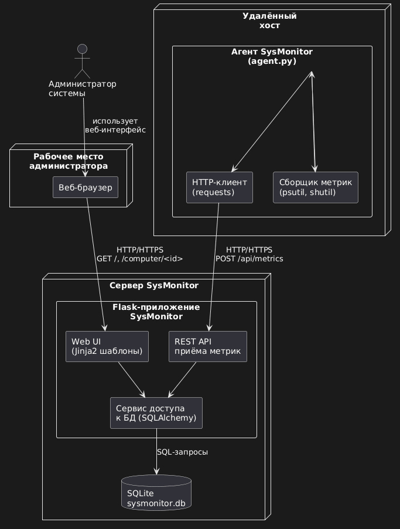

# SysMonitor — система мониторинга удалённых компьютеров

Курсовой проект по дисциплине «Разработка ПО с открытым исходным кодом».

Проект реализует упрощённую систему мониторинга: на удалённых компьютерах запускается агент, который собирает системные метрики и отправляет их на центральный Flask-сервер. Сервер сохраняет данные в БД и отображает их во веб-интерфейсе.

## Используемые технологии

- Язык: **Python 3**
- Веб-фреймворк: **Flask**
- База данных: **SQLite** (через SQLAlchemy)
- Библиотеки агента: **psutil**, **requests**, **shutil**, **socket**
- Среда разработки (IDE): **Visual Studio Code**
- Контроль версий: **Git + GitHub**

## Структура проекта и назначение модулей

```
SysMonitor/
├─ app/
│  ├─ __init__.py        # создание Flask-приложения, настройка БД, автообновление шаблонов
│  ├─ models.py          # модели SQLAlchemy: Computer, Metric и т.п.
│  ├─ routes.py          # маршруты Flask: главная страница, детали компьютера, API приёма метрик
│  ├─ templates/
│  │  ├─ layout.html     # базовый шаблон, общий layout приложения
│  │  ├─ index.html      # список компьютеров с краткими метриками (карточки)
│  │  └─ detail.html     # детальная страница с историей метрик конкретного компьютера
│  └─ static/            # (при необходимости: стили, изображения)
├─ agent.py              # агент, запускаемый на удалённом ПК: собирает метрики и отправляет их на сервер
├─ run.py                # точка входа для запуска Flask-сервера (app.run(debug=True))
└─ README.md             # документация по проекту
```

## UML-диаграмма

UML-диаграммы системы приложены в репозиторий.




## Запуск проекта

1. Клонировать репозиторий
```
git clone https://github.com/USERNAME/SysMonitor.git
cd SysMonitor
```
2. Установить зависимости
```
pip install -r requirements.txt
```
3. Запустить Flask-сервер
```
python run.py
```
4. Открыть в браузере
```
http://127.0.0.1:5000/
```
## Скрин-шоты


